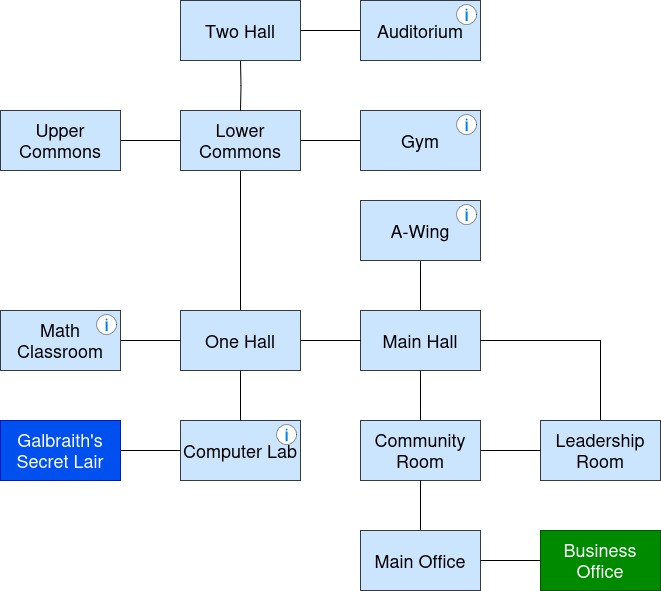

# Zuul
A Zuul game of Sunset High School.

HELP lists available commands in the program. In general, you can walk from room to room, pick up items, and put down items. 

The game map is displayed below. On this map, the Lower Commons is **north** of One Hall. Rooms marked with an I in the top right corner indicate that there is an item in the room.

